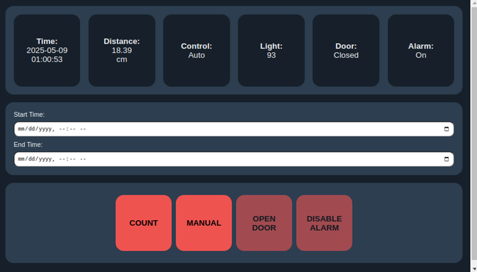
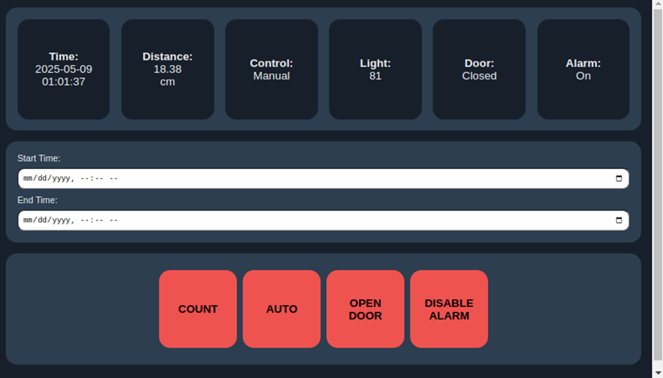
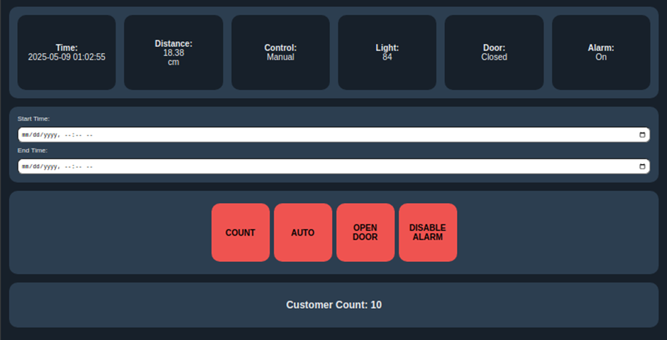

# 🚪 Automatic Door Control System
An IoT-based system that allows for **manual and automatic door control** to enhance security and track traffic. Developed with Arduino and Raspberry Pi using Flask, MySQL, and web technologies.

---

## 🔧 Features

### ✅ Automatic and Manual Operation Modes

* **Auto Mode**

  * Opens the door during the day when a person is detected
  * Keeps the door closed and triggers an alarm at night if someone is detected
* **Manual Mode**

  * Allows store owners to override the system and directly control door and alarm states

---

### 👁 Sensor Integration

* **Ultrasonic Sensor (HC-SR04):** Detects proximity and motion (digital input)
* **Photoresistor (LDR):** Detects ambient light levels to distinguish between day and night (analog input)

---

### ⚙ Actuator Control

* **Servo Motor (SG90):** Opens or closes the door based on logic conditions
* **LED Alarm Indicator:** Lights up during night intrusions (in either manual or automatic mode)

---

### 🧠 Edge Computing with Raspberry Pi

* Processes sensor data
* Logs data to a **MySQL** database
* Hosts a **Flask** web server with real-time dashboard access

---

### 🌐 Web-Based Dashboard

Built with **Flask (Python)** + **HTML/CSS/JavaScript**
Features:

* Real-time log display (distance, light level, door state, alarm state, control mode)
* Control toggles for:

  * Manual/Auto mode
  * Door state
  * Alarm state
* Customer traffic counter based on door open events
* Responsive UI for remote monitoring and control

---

### 💾 Data Logging

* All sensor readings and actuator states are stored in a **MySQL** database with timestamps
* Supports traffic analysis and performance tracking

---

## 🗂 System Architecture

| Layer                 | Components                                                              |
| --------------------- | ----------------------------------------------------------------------- |
| **Physical Layer**    | Sensors (Ultrasonic, LDR), Actuators (Servo, LED), Arduino Uno (ELEGOO) |
| **Edge Layer**        | Raspberry Pi running Flask app, MySQL, Serial Comm                      |
| **Application Layer** | Web interface (HTML, CSS, JS)                                           |
| **User Layer**        | Store owner interacting via browser                                     |

---

## 🖼 Interface Overview

**Auto Mode (Default):**


**Manual Mode:**


**With Traffic Count Displayed:**


---

## 🚀 How to Use

1. **Upload Arduino Code**
   Open the Arduino IDE and upload the sketch at:
   `/edge_device_controller/edge_device_controller.ino`

2. **Identify the Arduino Serial Port**

   * Plug your Arduino into the Raspberry Pi or computer
   * Use Arduino IDE or run `ls /dev/tty*` (Linux) to find the connected port (e.g., `/dev/ttyUSB0` or `/dev/ttyACM0`)

3. **Edit Serial Port in Python Script**
   In `edge_server.py`, locate the line:

   ```python
   ser = serial.Serial('/dev/ttyACM0', 9600, timeout=1)
   ```

   Replace `'/dev/ttyACM0'` with your actual port from Step 2

4. **Install Dependencies**
   Run the following command in your terminal:

   ```bash
   pip install -r requirements.txt
   ```

5. **Run the Edge Server**
   In the project directory, execute:

   ```bash
   python edge_server.py
   ```

6. **Open the Web Interface**

   * Visit the local address shown in your terminal
   * Use the interface to:

     * Monitor sensor readings and actuator states
     * Toggle control modes
     * Open/close the door or toggle the alarm
     * Count traffic within a given time range

---

## 🛠 Technologies Used

| Tool                          | Purpose                                        |
| ----------------------------- | ---------------------------------------------- |
| **Arduino (ELEGOO Uno)**      | Sensor reading & actuator control              |
| **Python (Flask)**            | Backend logic and web server                   |
| **MySQL**                     | Database for logging data                      |
| **HTML/CSS/JavaScript**       | Web-based user interface                       |
| **UART Serial Communication** | Communication between Arduino and Raspberry Pi |
